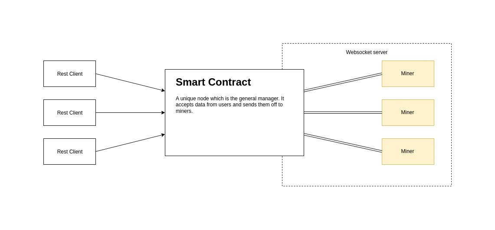

# BlockchainESD

Blockchain: Elements of Software Development

An example blockchain application for FTN NS.

## Table of contents

* [How everything works](#how-everything-works)
* [Clients](#clients)
* [Miners](#miners)
* [Data examples](#data-examples)
* [Generating codes via Python](#generating-codes-via-python)
* [Postman / Requests](#postman--requests)
* [Fedora Linux 37](#fedora-linux-37)
* [Ubuntu 22.04 on arm64](#ubuntu-2204-on-arm64)
* [SSL Support / Reverse proxy](#ssl-support-with-remote-host-and-reverse-proxy)

## How everything works

In this example we have the smart contract work both as a restful and a websocket server. The restful server is for clients while the websocket server is for miners. 



## Clients

Clients are created to just send a JSON body to the server. When the client sends the request it waits a couple of seconds for it to be processed and it has a value returned whether the request was okay or not.

## Miners 

Miners are connected to the websocket server for instant transmission of data. When a client requests information it is distrubuted/broadcasted accross all of the nodes. The miners will then send the information to the server to verify data. If all of the miners agree with the information then it means everything was correct. If one of the miners does not agree it is reprocessed.

On successful processing, the initial sender is saved and rewarded with the currency. Afterwards the blockchain is appended with the transaction.

## Data examples

    Example data: L9BMZ76TAHIDCZFXP7IH
    Example hash: 000f04a09c3c85d41194fa27f140360946e3c003e26b457ea4908af747e70bf4

    Example data: AJRHT1U53HZWN1XYVZPJ
    Example hash: 00004ef2dead454b2291d41d9811aa83c450a9f1f4d75f746dbb2d24c0d9dbec

    Example data: WDTYPNHQIXDO7BM4TJB0
    Example hash: 00073f3775ca4687305cba27a91e79166dcc8a95abb96a79f250789df18788c3

    Example data: PPVEE9L41ZIXV1UNAYF1
    Example hash: 000aa3e6e3167849f7962b0867aeed52334e8332c35d0f7d0f2dbf2822bb2436

    Example data: 4KYVRYYMU20IY8VQWNK9
    Example hash: 00099fbf4b808cc9b212111b56bd0beb471543bbe224ae3e052683beb786459b

    Example data: 6C6MZQ722MDD3E6SWPGN
    Example hash: 000b7d4e6fbebbc4c07be7268d4d5d636766708aeca744a67443b18077796573

    Example data: 81Z5R6ERD8D10GFIKDL2
    Example hash: 0000c48498c0424864a10d8e567a692587b70afc49cf17ed51b71fbf9b094e77

    Example data: 5W3FSY0S5PL1IY3ZAP9Q
    Example hash: 00027a02177b2e3b506a53b8f538daf58c6342cda1d99936ff3508fc1fcd964b

    Example data: ATQ900MP53HJKJTTO5ED
    Example hash: 000812ec54d6bba02743b8c2f10d97332dbfea6980154d04441fa896fcdc06f3

    Example data: KTEKLQ53JNCZYI9OHATX
    Example hash: 00098a3a978d7c0a6d725d19c788426a1468c3c7e371469d0507fe18e72cc423

## Generating codes via Python

```python
from hashlib import sha256
from random import choices
from string import ascii_uppercase, digits

dict = {}

while len(dict) < 10:
	generated = ''.join(choices(ascii_uppercase + digits, k = 20))
	hashed_string = sha256(generated.encode('utf-8')).hexdigest()
	if hashed_string[0:3] == "000":
		dict[generated] = hashed_string
		print("Example data: " + generated)
		print("Example hash: " + hashed_string + "\n")
```

## Postman / Requests

Under `Postman` there is a JSON file for all of the rest requests. Unfortunately it does not allow exporting websocket connects but you just need to connect to:

    ws://localhost:5067/miners/connect/ws

And the following information needs to be sent to connect to the server:

```json
{
    "topic": "miner",
    "event": "join"
}
```

Response on a successful join:

```json
{
    "topic": "miner",
    "event": "join:success",
    "data": {
        "uuid": "3fe65aa7-501b-4e90-a89b-e6ce953b983a"
    }
}
```

Response on a faulty join:

```json
{
    "topic": "miner",
    "event": "join:error",
    "data": {
        "message": "You can not double join!"
    }
}
```


And to leave the channel:

```json
{
    "topic": "miner",
    "event": "leave"
}
```

On a faulty leave:

```json
{
    "topic": "miner",
    "event": "leave:error",
    "data": {
        "message": "You need to be logged in to log out. Please log in to log out."
    }
}
```

On a successful leave (the reason can also be `hasty`):

```json
{
    "topic": "miner",
    "event": "leave:success",
    "data": {
        "reason": "normal"
    }
}
```

Get new job from the server:

```json
{
    "topic": "miner",
    "event": "job:new",
    "data": {
        "request": "L9BMZ76TAHIDCZFXP7IH",
        "user": "user-id"
    }
}
```

Send result from miner to the server after connection:

```json
{
    "topic": "miner",
    "event": "job:result",
    "data": {
        "data": "L9BMZ76TAHIDCZFXP7IH",
        "user": "user-id",
        "result": "000f04a09c3c85d41194fa27f140360946e3c003e26b457ea4908af747e70bf4"
    }
}
```

Get reward from server:

```json
{
    "topic": "miner",
    "event": "job:reward",
    "data": {
        "reward": 0.5
    }
}
```

Get blockchain update from server:

```json
{
    "topic": "miner",
    "event": "blockchain:append",
    "data": {
        "user": "user-id",
        "miner": "dfdca815-0543-4452-8dfa-38ac3152f499",
        "reward": 1,
        "timestamp": "2023-01-06T14:26:59.2227444Z"
    }
}
```

## Fedora Linux 37

*This was specifically made for a Fedora Silverblue 37 setup running inside a devcontainer.*

This is only specifically for users running Fedora Linux. To install the current LTS dotnet runtime you need to do:

    sudo dnf in dotnet

After that you need to install the correct dotnet `5.0` runtime for your system. Go to the [the official download website](https://dotnet.microsoft.com/en-us/download/dotnet/5.0) and download it for `x64`.

After that you want to run the following commands to install the SDK & runtimes:

```bash
sudo tar -zxvf dotnet-sdk-5.0.408-linux-x64.tar.gz -C /usr/lib64/dotnet/ ./sdk
sudo tar -zxvf dotnet-sdk-5.0.408-linux-x64.tar.gz -C /usr/lib64/dotnet/ ./shared/Microsoft.NETCore.App
sudo tar -zxvf dotnet-sdk-5.0.408-linux-x64.tar.gz -C /usr/lib64/dotnet/ ./shared/Microsoft.AspNetCore.App
```

Then you should be able to check your installed SDKs:

```bash
$ dotnet --list-sdks

5.0.408 [/usr/lib64/dotnet/sdk] # important
6.0.112 [/usr/lib64/dotnet/sdk]
```

And runtimes:

```bash
$ dotnet --list-runtimes 

Microsoft.AspNetCore.App 5.0.17 [/usr/lib64/dotnet/shared/Microsoft.AspNetCore.App] # important
Microsoft.AspNetCore.App 6.0.12 [/usr/lib64/dotnet/shared/Microsoft.AspNetCore.App]
Microsoft.NETCore.App 5.0.17 [/usr/lib64/dotnet/shared/Microsoft.NETCore.App] # important
Microsoft.NETCore.App 6.0.12 [/usr/lib64/dotnet/shared/Microsoft.NETCore.App]
```

After that you need to install the correct openssl which will work on fedora and dotnet5.

```bash
sudo dnf in https://download.copr.fedorainfracloud.org/results/dioni21/compat-openssl10/fedora-37-x86_64/02529460-compat-openssl10/compat-openssl10-1.0.2o-11.fc36.x86_64.rpm
```

And finally adding the correct env. variable to the system:

```bash
echo 'DOTNET_ROOT="/usr/lib64/dotnet"' | sudo tee -a /etc/environment
```

## Ubuntu 22.04 on arm64

*This was specifically made for a ubuntu setup on Oracle Cloud Ampere CPU.*

Go to the official microsoft [dotnet download page](https://dotnet.microsoft.com/en-us/download/dotnet) and download any supported LTS under `Linux arm64`. At the time of wriring this `.NET 6.0` is the latest LTS. Download `.NET 5.0` as well. 

After downloading both zip files and uploading them to the server, you can generate the `dotnet` folder:

```bash
mkdir dotnet
tar -zxvf dotnet-sdk-6.0.404-linux-arm64.tar.gz -C dotnet
tar -xzvf dotnet-sdk-5.0.408-linux-arm64.tar.gz -C ./dotnet/ ./sdk
tar -xzvf dotnet-sdk-5.0.408-linux-arm64.tar.gz -C ./dotnet/ ./shared/Microsoft.AspNetCore.App
tar -xzvf dotnet-sdk-5.0.408-linux-arm64.tar.gz -C ./dotnet/ ./shared/Microsoft.NETCore.App
```

Add the folder to system, link the binary and add env. variables:

```bash
sudo cp -r dotnet /usr/share
sudo ln -s /usr/share/dotnet/dotnet /usr/bin/dotnet
echo 'DOTNET_ROOT="/usr/share/dotnet"' | sudo tee -a /etc/environment
```

Test the installation:

```bash
$ dotnet --list-sdks

5.0.408 [/usr/share/dotnet/sdk]
6.0.404 [/usr/share/dotnet/sdk]
```

And clear the dotnet folder:

```bash
rm -r ./dotnet
```

After that you need to install an older version of `libssl` to support `.NET 5.0`:

```bash
wget http://ports.ubuntu.com/pool/main/o/openssl1.0/libssl1.0.0_1.0.2n-1ubuntu5_arm64.deb

sudo apt update
sudo dpkg -i libssl1.0.0_1.0.2n-1ubuntu5_arm64.deb
```

And potentially if there are some broken packages because of the older version of ssl:

```bash
sudo apt install --fix-broken
```

## SSL support with remote host and reverse proxy

The easiest way to spin up the application on a remote host and have SSL certificates is to use Caddy as a reverse proxy.

This example will be used for the Oracle Cloud server running Ubuntu 22.04.

Install caddy:

```bash
sudo apt install caddy
```

After that you need to edit `/etc/caddy/Caddyfile` and add a reverse proxy:

```
smartcontract.my.host {
    reverse_proxy localhost:5067
}
```

And add an `A` type DNS record to `smartcontract.my.host` pointing to the host IP address. 

As caddy does automatic SSL certificates, all of the `HTTP` requests need to be to sent to `https` and websocket requests to `wss`.

